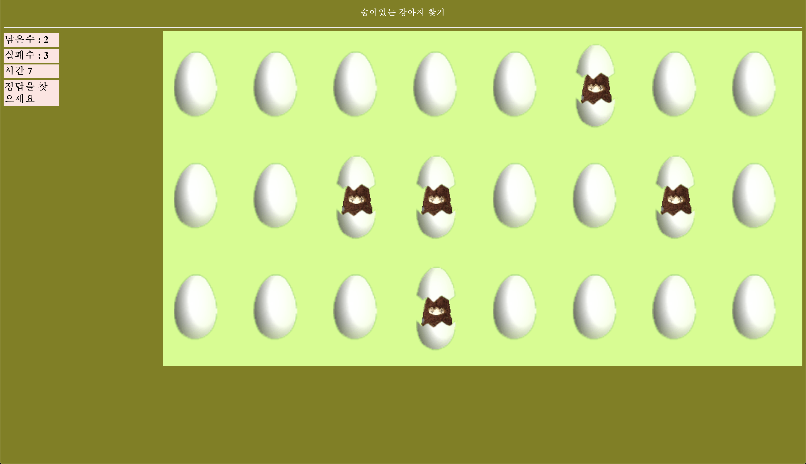

# find-the-dog

숨어 있는 강아지 찾기!
Kookmin University 2020 1학기 웹클라이언트컴퓨팅 기말 과제

## How To Play

1. [게임시작 버튼 클릭](#initial)
1. [강아지 *N* 마리, *T* 초 동안 찾을지 정하기](#customize)
1. [<b>10초간</b> 강아지 위치 외우기](#memorize)
1. [숨겨져 있는 강아지 N마리 T초 동안 찾기](#finding)
1. [게임 결과](#result)

## Preview

#### 
게임 시작 전

#### 
게임 설정

#### 
강아지 위치 외우기

#### 
강아지 찾기

#### 
게임 결과

게임 성공

게임 실패

